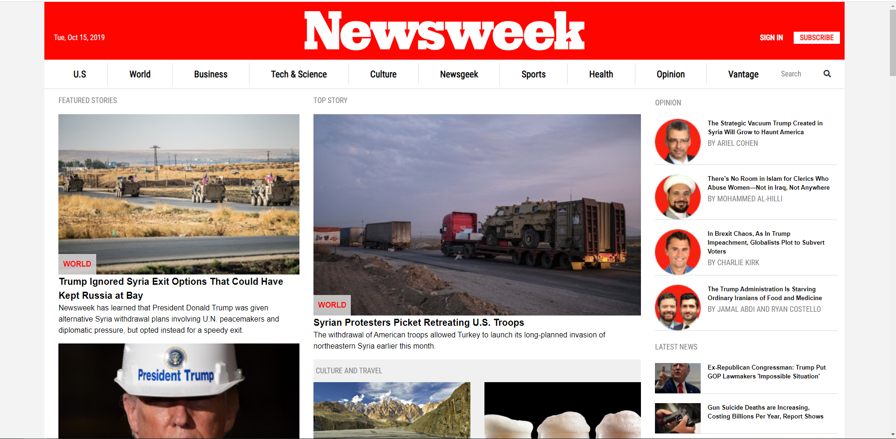

# Newsweek Replica

> A replica of the popular news site Newsweek



Newsweek is a news site that uses Bootstrap to style and align its elements. It is pivotal for a news site to be
mobile responsive and Bootstrap allows you to create front end apps that work on many screens of different sizes. This project is a demonstration of the effectiveness of Bootstrap and similar frameworks.

## Built With

- HTML/CSS3,
- Bootstrap 4,

## Live Demo

[Live Demo Link](https://livedemo.com)


## Getting Started

To get a local copy up and running follow these simple example steps.

### Prerequisites

- A JavaScript enabled Browser

### Setup and Usage

1. Clone the repo ``` git clone https://github.com/mrnadaara/Newsweek.git ```
2. Go into the cloned repo's folder ``` cd Newsweek ```
3. Open ``` index.html ``` to view the page

### Deployment

Deployed with Github Pages

## Authors

👤 **Sharma'arke Ahmed**

- Github: [@mrnadaara](https://github.com/mrnadaara)
- Twitter: [@mrnadaara](https://twitter.com/mrnadaara)
- Linkedin: [Sharma'arke Ahmed](https://www.linkedin.com/in/sharmarke-ahmed/)

## 🤝 Contributing

Contributions, issues and feature requests are welcome!

Feel free to check the [issues page](issues/).

## Show your support

Give a ⭐️ if you like this project!

## Acknowledgments

- [Microverse](https://www.microverse.org/) for providing this project requirements and specifications
## 📝 License

This project is [MIT](lic.url) licensed.